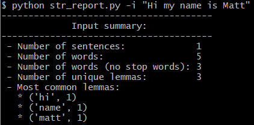

# text_helper: a TL;DR for your text
Tired of reading an entire string, text file, or webpage? Well, look no further: this repo has got you covered. From the convenience of your command line, we'll use NLP to extract those insights you've been itching to know: the number of words and sentences, the most common words, etc. Stick around to see the functions in this repo grow more nuanced and numerous.

## `str_report`
Our simplest script is one that runs on a string provided within the command line. After inputting a string, we get a report like this:  

The script has the following format:  
`python str_report.py [-h] -i "Hello" [-n 3]`  

`-i` specifies the input string and `-n` sets the number of lemmas to return. If you can't remember the arguments, type `-h` to get a help menu.
